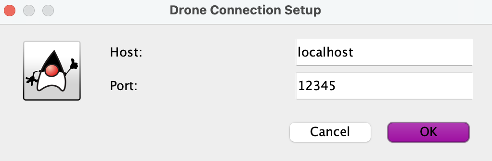
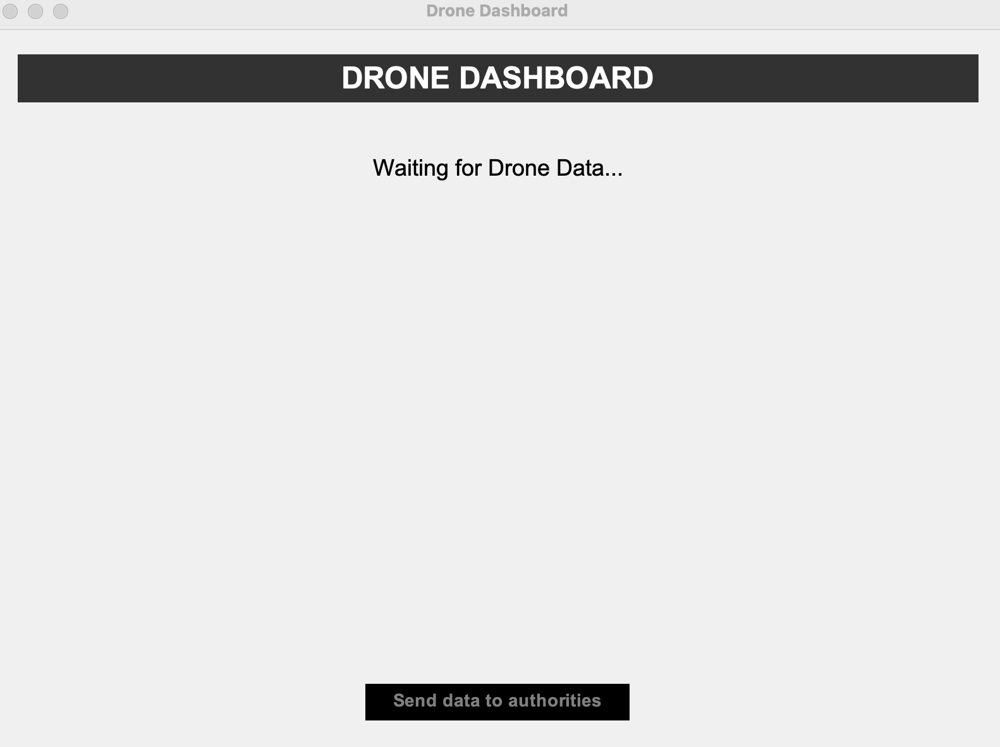
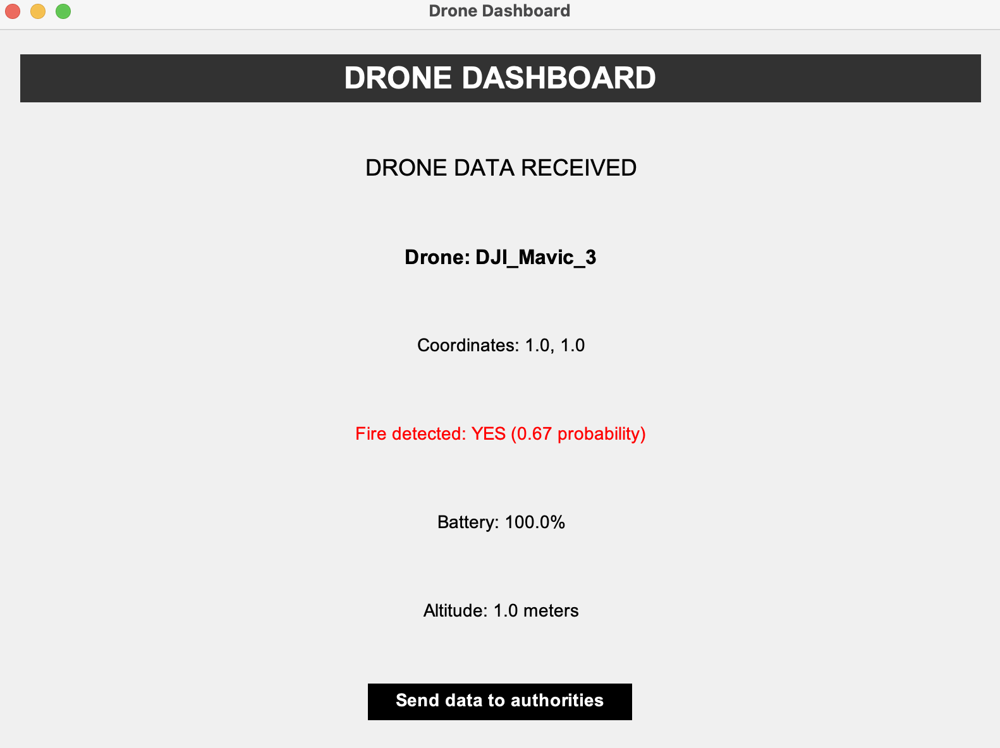

# Sem4-DroneDashboard

## About the Project
Application used alongside the Fire Detecting Drone project (for University) which allows the user to connect to a host and port in order to receive data remotely from a server to which the Drone is connected.

## Features
- **Python Interoperability**: Communication between Java and Python handled via TCP sockets for data retrieval.
- **Data Overview**: Full data overview received from the Drone to analyse and send to authorities (mock concept).

## How to Use
When opening the application, the user will be greeted with a panel in which they can insert the host and port of the server they wish to connect to.



After inserting a correct host and port (which will accept the connection request), the user will have to wait for drone data sent from the server.
The drone data is in CSV format and is of the following form: drone_name,latitude,longitude,fireDetected,fireProbability,batteryLevel,altitude.
If the server does not send all the data in this format it will not be correctly interpreted in the Dashboard.



After receiving correct data in the correct format from the Drone, it will be displayed. The `Send Data to Authorities` button will also be clickable now,
although it is not programmed to do anything as of this moment.



## Prerequisites
- **Java 11+** (JDK/JRE installed)
- **Python Fire-Detecting Drone server** running (private companion project)
- Active network connection between devices

## Usage

1. **Launch the Python Drone Server**
   - Run the Fire-Detecting Drone Python script first:
     ```bash
     python3 drone_server.py --host <IP> --port <PORT>
     ```

2. **Start the Java Dashboard**
   - Execute the compiled JAR file:
     ```bash
     java -jar DroneDashboard.jar
     ```
   - Or run from source in your preferred IDE.

3. **Connect to the Drone**
   - Enter the server's IP and port (e.g., `localhost:12345`) in the application
   - Click **Connect** to establish communication

4. **View Data**
   - Real-time drone coordinates, fire detection status, and metrics will populate the dashboard

5. **Send Alerts (Mock)**
   - Use the **"Send to Authorities"** button to simulate emergency notifications

### Notes
- Ensure the Python server is accessible (firewall/network permissions)
- Default test values: `localhost:12345` (if using loopback)

## Contact
Email: [sandru.darian@gmail.com](mailto:sandru.darian@gmail.com)  
Project Link: [https://github.com/Dio1000/Sem4-DroneDashboard](https://github.com/Dio1000/Sem4-DroneDashboard)
